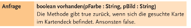

# Aufgabe 3c

## i)
 

```java
boolean vorhanden(String pFarbe, String pBild)
```
Die Methode gibt true zurück, wenn sich die gesuchte Karte im Kartendeck befindet. Ansonsten false.

### Anforderung:
Die Methode soll die Karten des Kartendecks durchlaufen und prüfen, ob die Karte mit der gesuchten Farbe und dem gesuchten Bild vorhanden ist. Wenn ja, soll true zurückgegeben werden. Wenn nein, soll false zurückgegeben werden.

### Visualisierung:


Ist die gesuchte Karte im Kartendeck vorhanden, wird true zurückgegeben. Ist die gesuchte Karte nicht im Kartendeck vorhanden, wird false zurückgegeben.

### Teilprobleme:
  * Durchlaufen des Kartendecks
  * Vergleich der Farbe und des Bildes der Karte mit der gesuchten Farbe und dem gesuchten Bild

### Implementation:
```java
/**
 * Prüft, ob sich eine Karte mit der gesuchten Farbe und dem gesuchten Bild im Kartendeck befindet.
 * @param pFarbe Die gesuchte Farbe.
 * @param pBild Das gesuchte Bild.
 * @return true, wenn die Karte im Kartendeck vorhanden ist, sonst false.
 */
boolean vorhanden(String pFarbe, String pBild)
{
    for (int i = 0; i < karten.length; i++)
    {
        if (karten[i].getFarbe().equals(pFarbe) && karten[i].getBild().equals(pBild))
        {
            return true;
        }
    }
    return false;
}
```

## ii)


```java
void aussortieren(String pFarbe)
```

### Anforderung:
Die Methode entnimmt alle Karten der Farbe pFarbe aus dem Kartendeck


### Visualisierung:
Das herausnehmen der Karten der Farbe pFarbe aus dem Kartendeck.


### Teilprobleme:
  * Durchlaufen des Kartendecks
  * Entfernen der Karten der Farbe pFarbe
  * Verschieben der Karten im Kartendeck

### Implementation:
```java
/**
 * Entnimmt alle Karten der Farbe pFarbe aus dem Kartendeck.
 * @param pFarbe Die Farbe, der die Karten entnommen werden sollen.
 */
public void aussortieren(String pFarbe){
    int anzahl = 0;
    for (int i = 0; i < karten.length; i++)
    {
        if (karten[i].getFarbe().equals(pFarbe))
        {
            anzahl++;
        }
    }
    Karte[] neueKarten = new Karte[karten.length - anzahl];
    int j = 0;
    for (int i = 0; i < karten.length; i++)
    {
        if (!karten[i].getFarbe().equals(pFarbe))
        {
            neueKarten[j] = karten[i];
            j++;
        }
    }
    karten = neueKarten;
}
```

## iii)
```java
boolean mehrRoteAlsSchwarzeKarten()
```

### Anforderung:
Es soll ermittelt werden, ob sich in der ersten Hälfte des Kartendecks mehr rote als schwarze Karten befinden.

### Visualisierung:


### Teilprobleme:
  * Durchlaufen der ersten Hälfte des Kartendecks
  * Ermitteln der Anzahl der roten und schwarzen Karten in der ersten Hälfte des Kartendecks
    * "rot" beschreibt die Farbe der Karten mit den Bildern "Herz" und "Karo"
    * "schwarz" beschreibt die Farbe der Karten mit den Bildern "Pik" und "Kreuz"
  * Vergleich der Anzahl der roten und schwarzen Karten in der ersten Hälfte des Kartendecks

### Implementation:
```java
/**
 * Ermittelt, ob sich in der ersten Hälfte des Kartendecks mehr rote als schwarze Karten befinden.
 * @return true, wenn sich in der ersten Hälfte des Kartendecks mehr rote als schwarze Karten befinden, sonst false.
 */
public boolean mehrRoteAlsSchwarzeKarten(){
    int anzahlRote = 0;
    int anzahlSchwarze = 0;
    for (int i = 0; i < karten.length / 2; i++)
    {
        if (karten[i].getFarbe().equals("Herz") || karten[i].getFarbe().equals("Karo"))
        {
            anzahlRote++;
        }
        else
        {
            anzahlSchwarze++;
        }
    }
    return anzahlRote > anzahlSchwarze;
}
```

## iv)
```java
quickSort(int pLinks, int pRechts,boolean output)
```

### Anforderung:
Die Methode sortiert das Kartendeck mit dem QuickSort-Algorithmus.

### Visualisierung:
Ein Bild hier:


### Teilprobleme:
  * Sortieren des Kartendecks mit dem QuickSort-Algorithmus:
    * Auswahl eines Pivot-Elements
    * Aufteilen des Kartendecks in zwei Teile
    * Sortieren der beiden Teile (rekursiv)
    * Zusammenfügen der beiden Teile
    * Ausgabe des Kartendecks, wenn output true ist
    * Rückgabe des Kartendecks 

### Implementation:
```java
 /**
     * Führt einen QuickSort auf dem Kartendeck durch.
     * @param links Der linke Index des Kartendecks.
     * @param rechts Der rechte Index des Kartendecks.
     * @param output bestimmt, ob ein output in der Konsole erfolgen soll.
     * @return temp Das Kartendeck.
     * @see <a href="https://www.baeldung.com/java-quicksort">Quicksort</a>
     */
    public Karte[] quickSort(int links, int rechts, boolean output) {
        Karte[] temp = Kartendeck;
        int i = links;
        int j = rechts;
        int pivot = (links + rechts) / 2;
        while (i <= j) {
            while (temp[i].gibFarbe().compareTo(temp[pivot].gibFarbe()) < 0) {
                i++;
            }
            while (temp[j].gibFarbe().compareTo(temp[pivot].gibFarbe()) > 0) {
                j--;
            }
            if (i <= j) {
                Karte tempKarte = temp[i];
                temp[i] = temp[j];
                temp[j] = tempKarte;
                i++;
                j--;
            }
        }
        if (links < j) {
            quickSort(links, j, output);
        }
        if (i < rechts) {
            quickSort(i, rechts, output);
        }
        if (output) {
            kartenAusgeben(true);
        }
        return temp;
    }
```

